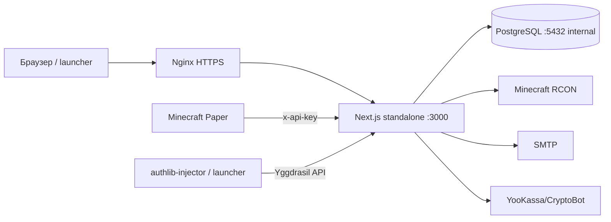

# ТЗ: перенос NATUX WORLD на production-сервер

## 1. Цель

Перенести сайт, backend, авторизацию, PostgreSQL, магазин, платежи, админ-панель, Minecraft API, RCON-мост и Paper-плагин с локальной машины на VPS. После выполнения пользователь должен открывать сайт по HTTPS, регистрироваться, подтверждать email, входить, покупать товар, а оплаченный товар должен доставляться в Minecraft.

Агент выполняет ТЗ последовательно, не оставляет mock-режимы в production и не считает работу завершённой только потому, что контейнеры имеют статус `Up`.

## 2. Обязательное решение по домену

В коде сейчас используются оба варианта: `vibestudy.ru`/`mc.vibestudy.ru` и `natuxworld.ru`/`mc.natuxworld.ru`. Для миграции без изменения desktop-launcher принять каноническим доменом:

- сайт: `vibestudy.ru`;
- Minecraft: `mc.vibestudy.ru`;
- HTTPS API: `https://vibestudy.ru`.

Не использовать IP-адрес как публичный URL. Не использовать старый `vps-setup.sh` без изменений: в нём есть старые домен, email и домашний/Tailscale IP.

Если владелец сознательно выбирает `natuxworld.ru`, до деплоя заменить домен во всех файлах `website`, в `website/nginx.conf`, `.env` и во всех вызовах root-launcher в `src/` и `electron/`, затем пересобрать launcher. Самостоятельно смешивать два домена запрещено.

## 3. Текущая архитектура



Стек: Next.js 14 App Router, React 18, TypeScript, Prisma 7, PostgreSQL 16, Nginx, Docker Compose, Paper API 1.21.1, Java 21.

## 4. Полный состав, который нужно перенести

Перенести весь каталог `website/`, включая незакоммиченные файлы. В текущем репозитории каталог `website` является untracked, поэтому нельзя полагаться только на `git pull`: проверить, что он реально попал в архив/репозиторий/копию.

### 4.1 Обязательные файлы deployment и конфигурации

```text
website/Dockerfile
website/docker-compose.yml
website/nginx.conf
website/.env.example
website/package.json
website/package-lock.json
website/next.config.mjs
website/next-env.d.ts
website/tsconfig.json
website/tailwind.config.ts
website/postcss.config.js
website/prisma.config.ts
website/vitest.config.ts
website/DEPLOY.md
website/readme.md
website/vps-setup.sh              # только справочно, не запускать без правок
```

### 4.2 Prisma и база данных

```text
website/prisma/schema.prisma
website/prisma/migrations/migration_lock.toml
website/prisma/migrations/20260531235913_init/migration.sql
website/prisma/migrations/20260612120000_add_coupons/migration.sql
website/prisma/migrations/20260614000000_add_login_events/migration.sql
website/prisma/migrations/20260614100000_add_game_token/migration.sql
website/prisma/migrations/20260614200000_add_user_table/migration.sql
website/prisma/migrations/20260615000000_add_token_version/migration.sql
website/prisma/migrations/20260615200000_add_crash_report/migration.sql
website/prisma/migrations/20260615210000_add_ban_fields/migration.sql
website/prisma/migrations/20260615220000_add_game_events/migration.sql
website/prisma/migrations/20260615230000_add_two_factor/migration.sql
website/prisma/migrations/20260617000000_add_admin_audit/migration.sql
website/prisma/migrations/20260618020000_add_products/migration.sql
website/prisma/migrations/20260712000000_harden_orders_and_game_tokens/migration.sql
website/prisma/migrations/20260830000000_add_crypto_payment_quote/migration.sql
```

Миграции запускать только через `prisma migrate deploy`. Не использовать `prisma db push` на production и не удалять существующий volume PostgreSQL.

### 4.3 Backend, страницы и frontend

Перенести без исключений:

```text
website/src/app/**
website/src/components/**
website/src/lib/**
website/src/middleware.ts
website/src/app/globals.css
website/public/**
```

В `src/app` должны присутствовать страницы `/`, `/shop`, `/order/[publicId]`, `/pay/[id]`, `/leaderboard`, `/rules`, `/map`, `/join`, `/news`, `/privacy`, `/refund`, `/offer`, `/admin`, `/admin/login`, `/admin/tech`.

### 4.4 API, которые должны работать после переноса

Проверить все маршруты, а не только главную страницу:

```text
website/src/app/api/health/route.ts
website/src/app/api/products/route.ts
website/src/app/api/orders/route.ts
website/src/app/api/orders/[publicId]/route.ts
website/src/app/api/server/status/route.ts
website/src/app/api/leaderboard/route.ts
website/src/app/api/coupons/validate/route.ts
website/src/app/api/rates/route.ts
website/src/app/api/game-event/route.ts
website/src/app/api/crash-report/route.ts
website/src/app/api/payments/**
website/src/app/api/auth/**
website/src/app/api/yggdrasil/**
website/src/app/api/admin/**
```

Тесты внутри `src/**/__tests__` и `route.test.ts` также перенести и запускать перед деплоем.

### 4.5 Paper-плагин

```text
website/natux-plugin/pom.xml
website/natux-plugin/src/main/java/ru/vibestudy/natuxplugin/NatuxPlugin.java
website/natux-plugin/src/main/java/ru/vibestudy/natuxplugin/ApiSender.java
website/natux-plugin/src/main/java/ru/vibestudy/natuxplugin/EventBuffer.java
website/natux-plugin/src/main/java/ru/vibestudy/natuxplugin/GameEvent.java
website/natux-plugin/src/main/java/ru/vibestudy/natuxplugin/PlayerListener.java
website/natux-plugin/src/main/java/ru/vibestudy/natuxplugin/AntiCheatListener.java
website/natux-plugin/src/main/java/ru/vibestudy/natuxplugin/ViolationTracker.java
website/natux-plugin/src/main/resources/config.yml
website/natux-plugin/src/main/resources/plugin.yml
```

Собирать командой `mvn clean package` на Java 21. В production `config.yml` должен отправлять события на `https://vibestudy.ru/api/game-event`, содержать настоящий `GAME_API_KEY` и никогда не использовать `CHANGE_ME`, `127.0.0.1` или `http://`.

### 4.6 Что не переносить

```text
website/.env
website/node_modules/
website/.next/
website/.git/
website/backups/             # переносить только отдельно и зашифрованно, если нужна БД
логи, временные файлы, key.pem и любые секреты
```

Root-проект `src/`, `electron/`, `package.json` и launcher не запускаются как backend. Они нужны только для desktop-клиента. Их менять только при смене канонического домена.

## 5. Требования к VPS

- Ubuntu 22.04/24.04 или Debian 12.
- Минимум 2 vCPU, 4 GB RAM, 40 GB SSD; для Minecraft лучше отдельный сервер или минимум 8 GB RAM.
- Docker Engine и Docker Compose plugin.
- Открыты только TCP `22`, `80`, `443`; порт `5432` не публиковать.
- Порт Next.js `3000` не публиковать наружу.
- RCON `25575` не публиковать наружу; разрешить только от app-контейнера/приватной сети.
- Включить автоматические security updates, timezone `UTC` или явно зафиксированную timezone.
- Создать отдельного deploy-пользователя без работы под root.

Рекомендуемая директория проекта: `/srv/natux/website`.

## 6. DNS и SSL

До запуска создать DNS:

```text
A     vibestudy.ru       -> PUBLIC_VPS_IP
A     www.vibestudy.ru   -> PUBLIC_VPS_IP
A     mc.vibestudy.ru    -> MINECRAFT_PUBLIC_IP
```

Если используется IPv6, AAAA должен указывать на правильный VPS; иначе убрать ошибочную AAAA-запись.

Получить сертификат Let's Encrypt для `vibestudy.ru` и `www.vibestudy.ru`. Текущий Nginx ожидает сертификаты в `/etc/letsencrypt/live/vibestudy.ru/`, поэтому нельзя сначала запускать HTTPS-конфигурацию без сертификата. Последовательность:

1. временно поднять HTTP-only Nginx или получить сертификат standalone при остановленном контейнере nginx;
2. получить сертификат certbot;
3. проверить наличие `fullchain.pem` и `privkey.pem`;
4. вернуть HTTPS-конфигурацию;
5. выполнить `docker compose up -d nginx` и `docker compose exec nginx nginx -t`.

В `nginx.conf` обязательно проксировать `Host`, `X-Real-IP`, `X-Forwarded-For` значением `$remote_addr`, `X-Forwarded-Proto`; оставить лимит тела запроса `10m`. После проверки HTTPS включить HSTS.

## 7. Переменные окружения

Создать `/srv/natux/website/.env` с правами `chmod 600`. Значения ниже заменить реальными; шаблонные значения в production запрещены.

| Переменная | Назначение |
|---|---|
| `NODE_ENV` | строго `production` |
| `DATABASE_URL` | внутри Compose: `postgresql://natux:<password>@postgres:5432/natux` |
| `POSTGRES_PASSWORD` | пароль PostgreSQL |
| `NEXT_PUBLIC_SERVER_NAME` | название сервера |
| `NEXT_PUBLIC_SITE_DOMAIN` | `vibestudy.ru` |
| `NEXT_PUBLIC_SERVER_IP` | адрес Minecraft, обычно `mc.vibestudy.ru` |
| `NEXT_PUBLIC_SERVER_VERSION` | версия Minecraft |
| `NEXT_PUBLIC_VK_URL`, `NEXT_PUBLIC_DISCORD_URL`, `NEXT_PUBLIC_TELEGRAM_URL`, `NEXT_PUBLIC_YOUTUBE_URL` | реальные ссылки, не `#` для используемых сетей |
| `PAYMENT_PROVIDER` | `yookassa`, `cryptobot` или `multi`; не `mock` |
| `YOOKASSA_SHOP_ID`, `YOOKASSA_SECRET_KEY` | YooKassa, если выбран `yookassa`/`multi` |
| `CRYPTO_BOT_TOKEN`, `CRYPTO_BOT_NETWORK` | CryptoBot, если выбран `cryptobot`/`multi`; сеть `mainnet` или тестовая по договорённости |
| `YOOMONEY_WALLET`, `YOOMONEY_SECRET` | legacy; не включать без отдельной проверки полного payment flow |
| `JWT_SECRET` | случайная строка минимум 32 байта |
| `SMTP_HOST`, `SMTP_PORT`, `SMTP_USER`, `SMTP_PASS`, `MAIL_FROM` | отправка кодов подтверждения и 2FA |
| `ADMIN_PASSWORD`, `ADMIN_SECRET`, `ADMIN_TOTP_SECRET`, `ADMIN_ALLOWED_IPS` | админ-панель и обязательный TOTP |
| `GAME_API_KEY` | ключ Paper-плагина для `/api/game-event` |
| `TWOFA_ENC_KEY` | AES-256 ключ, 64 hex-символа |
| `GAME_TOKEN_TTL_HOURS` | срок Minecraft-токена, например `24` |
| `YGGDRASIL_PRIVATE_KEY` | RSA-2048 private key в `.env` одной строкой с `\n` |
| `RCON_HOST`, `RCON_PORT`, `RCON_PASSWORD` | подключение к Minecraft RCON |
| `RCON_MOCK` | строго `false` или unset |
| `MC_MOCK` | строго `false` или unset |
| `MC_SSH_HOST`, `MC_SSH_USER`, `MC_SSH_KEY_B64` | SSH bridge к Minecraft-хосту, если используется |
| `MC_SSH_HOST_KEY_FINGERPRINT` | обязательный SHA-256 fingerprint SSH host key |

Сгенерировать секреты, не вставляя их в git:

```bash
openssl rand -hex 32       # JWT_SECRET, TWOFA_ENC_KEY, ADMIN_SECRET
openssl rand -base64 32    # GAME_API_KEY
openssl genrsa 2048 > key.pem
```

SMTP в текущей реализации рассчитан на SSL-порт `465`. Для порта `587` сначала отдельно проверить/исправить STARTTLS-режим, затем тестировать письмо.

Важно: текущий `docker-compose.yml` должен передавать в app `MC_SSH_HOST_KEY_FINGERPRINT`. Если этой строки нет в передаваемом агентом файле, добавить её до деплоя.

## 8. Порядок установки

```bash
cd /srv/natux
git clone <REPOSITORY_URL> .
cd /srv/natux/website
cp .env.example .env
chmod 600 .env
```

Проверить, что в каталоге присутствуют Dockerfile, Compose, Prisma и весь `src`. Затем:

```bash
docker compose config
npm ci
npm run check-secrets
npm run typecheck
npm test
npm run lint
npm run build
docker compose build --pull
docker compose up -d postgres
docker compose ps
docker compose exec postgres pg_isready -U natux -d natux
docker compose run --rm app node node_modules/prisma/build/index.js migrate deploy
docker compose up -d
docker compose ps
docker compose logs --tail=200 app
docker compose logs --tail=100 nginx
```

`npm ci` и локальный build можно выполнять во временном checkout или внутри builder; production image всё равно собирать из lockfile. Не запускать `vps-setup.sh` вслепую.

После миграций проверить таблицы `User`, `Product`, `ProductVariant`, `Order`, `GameToken`, `GameEvent`, `CrashReport`, `AdminAudit`. Seed-файла в проекте нет: если товары отсутствуют, создать их через админ-панель/админ API с согласованными ценами, не придумывать цены автоматически.

## 9. Исправления Compose перед production

Проверить и при необходимости внести в `website/docker-compose.yml`:

- передавать `MC_SSH_HOST_KEY_FINGERPRINT` в app;
- не публиковать PostgreSQL и app;
- использовать `DATABASE_URL` с именем сервиса `postgres`, а не `localhost`;
- оставить healthcheck app на `/api/health`;
- не монтировать `.env` внутрь образа;
- не добавлять секреты в Dockerfile, image layers или логи.

В `nginx.conf` заменить домен на выбранный канонический, проверить upstream `app:3000`, TLS-пути и redirect HTTP→HTTPS.

## 10. Minecraft, RCON и Paper

На Minecraft-хосте включить в `server.properties`:

```properties
enable-rcon=true
rcon.port=25575
rcon.password=<тот же RCON_PASSWORD>
```

Если Minecraft и сайт на одном VPS, использовать внутренний адрес/Compose network. Если Minecraft отдельно, разрешить RCON/SSH только с IP VPS или через VPN. Проверить RCON из app-контейнера, затем открыть `/admin/tech` и выполнить безопасную тестовую команду.

Собрать плагин:

```bash
cd /srv/natux/website/natux-plugin
mvn clean package
```

Скопировать полученный shaded jar в `plugins/` Paper-сервера, выставить в `config.yml` production API URL и `GAME_API_KEY`, перезапустить Paper. Проверить join/chat/command event и доставку в `/api/admin/game-events`.

## 11. Авторизация и Yggdrasil

Обязательный сценарий:

1. `POST /api/auth/register` с тестовым email;
2. получить письмо SMTP;
3. `POST /api/auth/verify-email` с кодом;
4. войти через `/api/auth/login`;
5. включить TOTP, проверить backup code, logout/login;
6. проверить `/api/auth/me` и `/api/auth/game-session`;
7. проверить Yggdrasil metadata на `https://vibestudy.ru/api/yggdrasil`;
8. проверить authenticate, refresh, validate, join и hasJoined через authlib-injector.

Не логировать JWT, пароли, TOTP, backup codes, SMTP/API keys или private key.

## 12. Платежи и доставка

Выбрать один поддержанный production-вариант:

- `yookassa` — YooKassa;
- `cryptobot` — CryptoBot;
- `multi` — YooKassa + CryptoBot.

`PAYMENT_PROVIDER=mock` разрешён только локально. Legacy YooMoney не подключать автоматически: текущая конфигурация и resolver требуют отдельного end-to-end решения.

Настроить HTTPS webhook URL:

```text
https://vibestudy.ru/api/payments/yookassa
https://vibestudy.ru/api/payments/cryptobot
```

Провести тестовую оплату в sandbox/testnet либо минимальную реальную тестовую оплату. Проверить: invoice создаётся, webhook проходит проверку подписи/токена, сумма и asset совпадают, заказ становится paid, команда отправляется ровно один раз, повтор webhook идемпотентен, страница заказа показывает результат.

## 13. Админка

Перед открытием `/admin`:

- заменить все placeholders в `ADMIN_*`;
- задать реальные IP в `ADMIN_ALLOWED_IPS`;
- настроить TOTP и сохранить recovery-коды вне сервера;
- проверить вход и `/api/admin/stats`;
- проверить просмотр заказов, retry/refund, products, users, RCON и game events.

Скрипт `website/scripts/admin-totp-setup.mjs` использовать только после проверки его параметров и не сохранять сгенерированный secret в репозитории.

## 14. Smoke-test после запуска

```bash
curl -fsS https://vibestudy.ru/api/health
curl -fsS https://vibestudy.ru/api/products
curl -I https://vibestudy.ru
docker compose ps
docker compose exec nginx nginx -t
```

Критерии smoke-test:

- `/api/health` возвращает HTTP 200 и `{"status":"ok","database":"ok"}`;
- сайт и статические assets открываются по HTTPS;
- HTTP перенаправляется на HTTPS;
- регистрация, email verification, login и 2FA работают;
- admin login работает только с разрешённого IP и TOTP;
- products/order/payment/webhook/delivery работают;
- повтор webhook не дублирует доставку;
- Paper event принимается с правильным API key;
- RCON-команда выполняется и ошибка видна в админке;
- Yggdrasil authenticate/refresh/validate/join/hasJoined работают;
- после рестарта app и VPS данные и миграции сохраняются.

## 15. Backup, мониторинг и откат

Использовать `website/scripts/backup-postgres.sh` ежедневно, хранить копии вне VPS и проверить восстановление на отдельную тестовую БД. Локальный Docker volume не считать backup.

```bash
cd /srv/natux/website
chmod +x scripts/backup-postgres.sh
./scripts/backup-postgres.sh
```

Настроить мониторинг HTTPS `/api/health`, диска, RAM, CPU, сроков SSL, статуса контейнеров и размера PostgreSQL. Хранить логи с ротацией.

Перед обновлением:

```bash
./scripts/backup-postgres.sh
docker compose config
docker compose build --pull
docker compose up -d
docker compose logs --tail=200 app
```

Если новая версия не проходит healthcheck, вернуть предыдущий image/commit, не удаляя volume PostgreSQL, и восстановить БД только если миграция необратимо изменила данные. `.env` сохранить отдельно.

## 16. Ограничения и известные риски

- Не коммитить `.env`, SSH keys, SMTP credentials, payment tokens, JWT/TOTP secrets или RSA private key.
- Не использовать `localhost` для соединения app с PostgreSQL.
- Не открывать наружу `5432`, `3000`, `25575`.
- Не запускать mock RCON, mock payments или mock Minecraft API.
- Проверить npm audit отдельно: текущий audit сообщает high/moderate advisories; не обновлять Next.js major автоматически во время миграции, а оформить отдельную задачу совместимого обновления.
- Maven может отсутствовать на локальной машине; сборку Paper выполнять на build-сервере/CI с Java 21.
- Не менять цены товаров, доменные имена, платежного провайдера или структуру БД без фиксации решения в deploy log.

## 17. Финальный отчёт агента

Агент обязан вернуть:

1. IP VPS и выбранный канонический домен;
2. commit/tag или checksum развернутого кода;
3. список Docker-сервисов и их health status;
4. результат Prisma migrations;
5. результат `typecheck`, `test`, `lint`, `build`;
6. результат каждого smoke-test;
7. выбранный платежный provider и проверенные webhook URL;
8. результат SMTP, RCON, Paper и Yggdrasil тестов;
9. путь и расписание backup плюс результат тестового восстановления;
10. команды rollback и список оставшихся рисков.

Работа считается завершённой только после прохождения всех критериев раздела 14 и предоставления отчёта из этого раздела.
